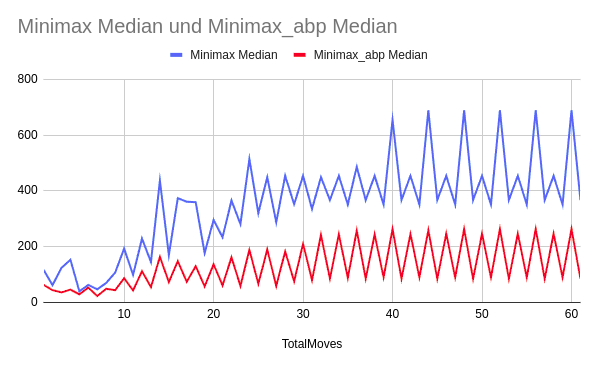
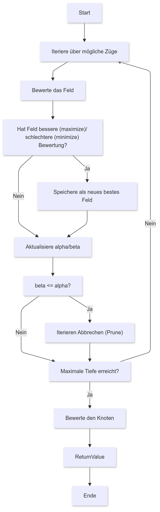

# Implementierung des Minimax-Algorithmus mit Alpha-Beta-Pruning

## Forschungsfrage

Wie beeinflusst die Verwendung von Alpha-Beta-Pruning die Effizienz des Minimax-Algorithmus beim Spielen von Dame?

## Theorie

### Minimax-Algorithmus [Q1, 8.2.2]

Der Minimax-Algorithmus ist ein Entscheidungsalgorithmus, der verwendet wird, um optimale Spielzüge in Spielen mit zwei Spielern zu finden. Ziel ist es, die Gewinnchancen des einen Spielers zu maximieren, während die des Gegners minimiert werden. Wie im Ablaufdiagramm [B3] zu sehen, wird dabei, über alle möglichen Züge iteriert, der beste (maximierer) bzw. der schlechteste (minimierer) gespeichert und dies wird so oft wiederhohlt, bis eine vorher angegebene maximale Tiefe erreicht wird.

### Alpha-Beta-Pruning [Q1, 8.3.3]

Alpha-Beta-Pruning ist eine Optimierung des Minimax-Algorithmus. Es reduziert die Anzahl der zu bewertenden Knoten im Suchbaum, indem es Zweige abschneidet, die nicht zum optimalen Zug beitragen. Dadurch wird die Effizienz deutlich gesteigert, ohne die Genauigkeit der Entscheidungen zu beeinträchtigen.
Wie im Ablaufdiagramm [B4] zu sehen, werden dafür 2 Werte alpha und beta initialisiert, welche als obere und untere Schranke dienen. Nun wird wie bei dem Standard Minimax Algorithmus über die möglichen Züge iteriert, diese werden bewertet und das Feld mit der besten (maximierer) bzw. der schlechtesten (minimierer) Bewertung wird gespeichert. Bei jedem Durchlauf wird nun nach jedem Feld bei
- minimierer: der kleinere wert zwischen beta und der Bewertung des aktuellen Felds als beta gespeichert
- maximierer: der größere wert zwischen alpha und der Bewertung des aktuellen Felds als alpha gespeichert
Ist beta kleiner gleich alpha, wird die Suche auf dem aktuellen branch abgebrochen.
Ansonsten wird die Suche so lange fortgeführt, bis eine vorher angegebene maximale Tiefe erreicht wird.

## Implementierung

### Übernahme aus Praktikum 1

Das Grundgerüst des Dame-Spiels sowie die grundlegenden Bewertungsfunktionen wurden aus Praktikum 1 übernommen. Die Modifikation betrifft die Implementierung des Algorithmus: Anstelle von A* wurde der Minimax-Algorithmus mit und ohne Alpha-Beta-Pruning verwendet.

### Ablauf Tests

1. **Initialisierung**: Die Spielfeldgröße wurde auf 8×8 festgelegt, um die Performance des Algorithmus auf einem realistischen Spielfeld zu testen. Aufgrund der hohen Rechenzeit wurden für wiederholte Tests kleinere Spielfelder mit 4×5 Feldern verwendet.
2. **Zugbewertung**: Der Algorithmus bewertet die möglichen Spielzüge rekursiv, basierend auf einer definierten Bewertungsfunktion für Spielstände.
3. **Optimierung**: Beim Alpha-Beta-Pruning werden Grenzwerte _alpha_ und _beta_ eingeführt, um die Suche einzuschränken.

## Testergebnisse

### 8×8 Spielfeld

Wie auf dem Diagramm [B1] zu sehen, wurden auf einem vollständigen Spielfeld (8×8) folgende Ergebnisse erzielt:
- **Ohne Alpha-Beta-Pruning**: Bis zu 143.000 Knoten wurden analysiert, und die Berechnung dauerte über 20 Minuten.
- **Mit Alpha-Beta-Pruning**: Durchschnittlich wurden pro Zug maximal 8.000 Knoten betrachtet, und die Berechnung dauerte ca. 2 Minuten.

### 4×5 Spielfeld

Zur Durchführung von 1.000 Simulationen wurde ein reduziertes Spielfeld (4×5) verwendet. Wie auf dem Diagramm [B2] zu sehen, zeigte sich dabei:
- **Ohne Alpha-Beta-Pruning**: Bis zu 650 Knoten wurden analysiert.
- **Mit Alpha-Beta-Pruning**: Durchschnittlich wurden pro Zug maximal 250 Knoten betrachtet.

Die Ergebnisse zeigen, dass Alpha-Beta-Pruning die Anzahl der betrachteten Knoten sowie die Rechenzeit drastisch reduziert.

## Fazit

Die Implementierung des Minimax-Algorithmus mit Alpha-Beta-Pruning hat gezeigt, dass die Effizienz des Algorithmus erheblich verbessert werden kann. Im Vergleich zur ursprünglichen A*-Implementierung aus Praktikum 1 ist der Algorithmus nun besser an die Anforderungen von Spielen mit großen Suchbäumen angepasst.

## Quellen & Referenzen

[Q1] Algorithmen in Python: 32 Klassiker vom Damenproblem bis zu neuronalen Netzen
Kopec, David; 1. Aufl; ISBN: 978-3-8362-7749-5
[Q2] Implementierungsdetails aus Praktikum 1 (siehe [Dokumentation P1](p1_dokumentation.md))
[R1] Quellcode Dame Anwendung (https://github.com/Lesekater/HAW-KI-Praktika.git)

## Bilder

[B1] 
[B2] 
[B3] 
[B4] 